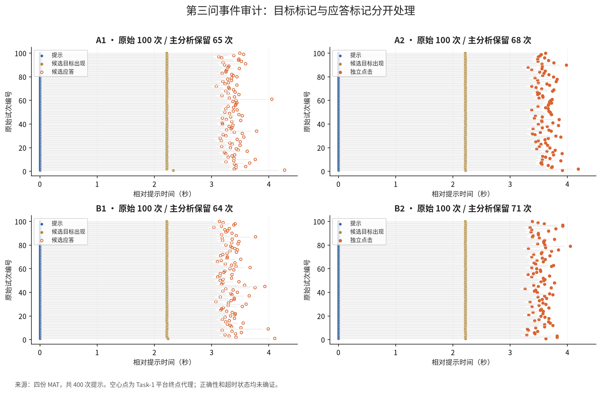
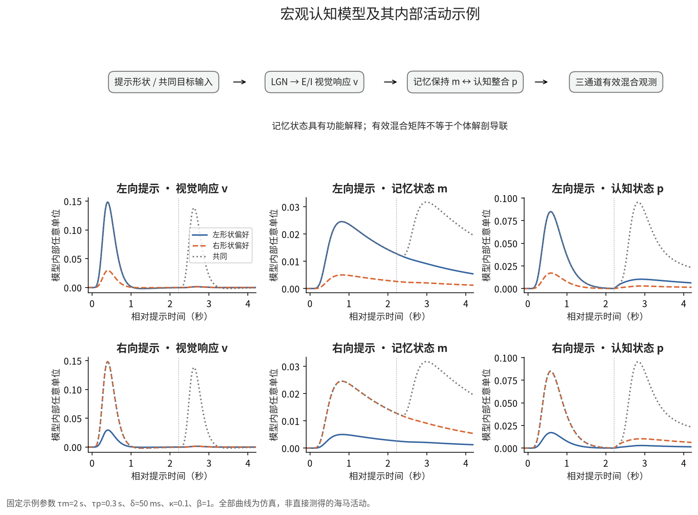
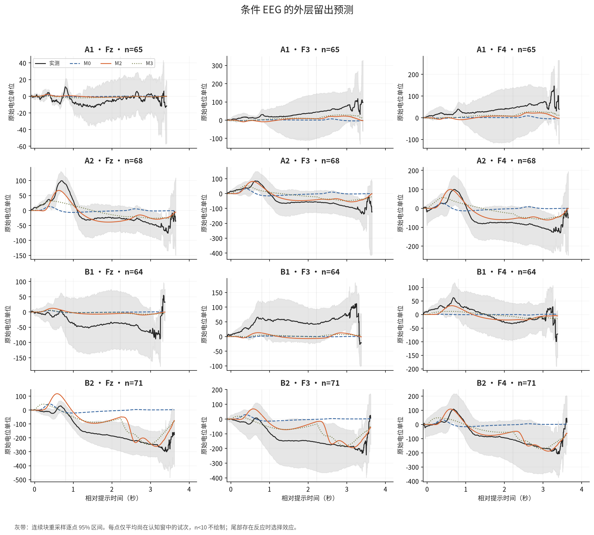
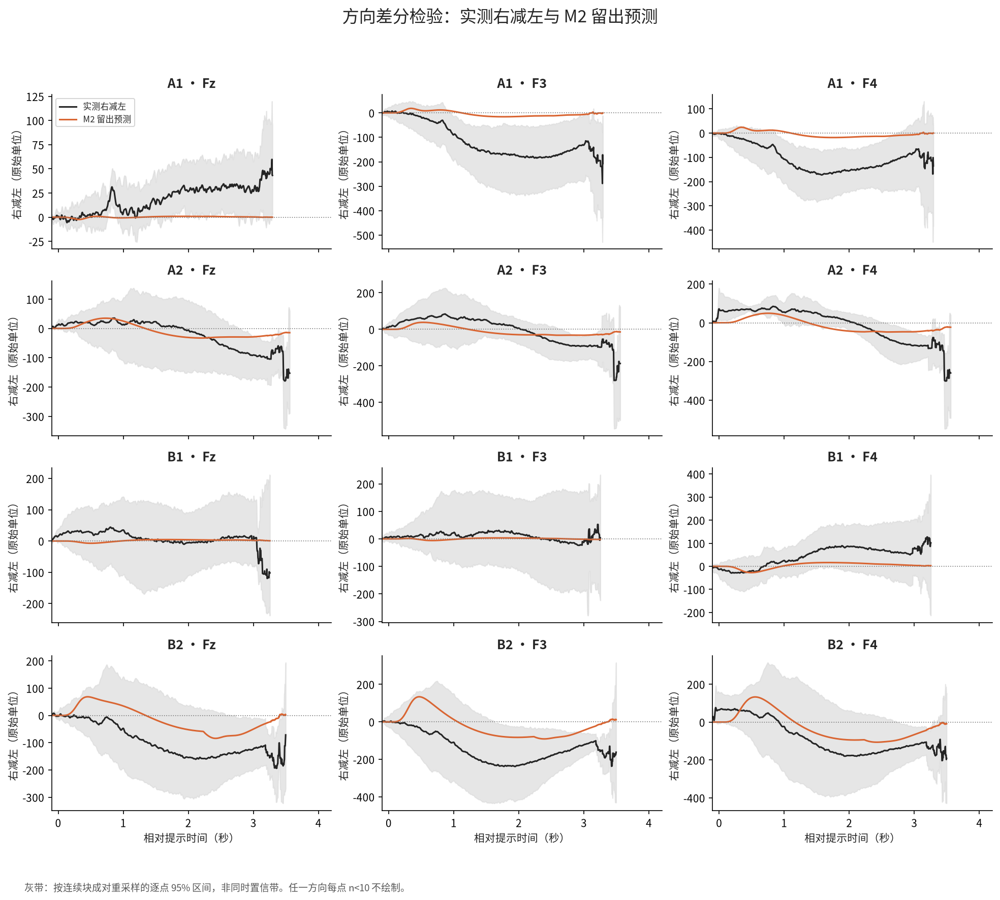
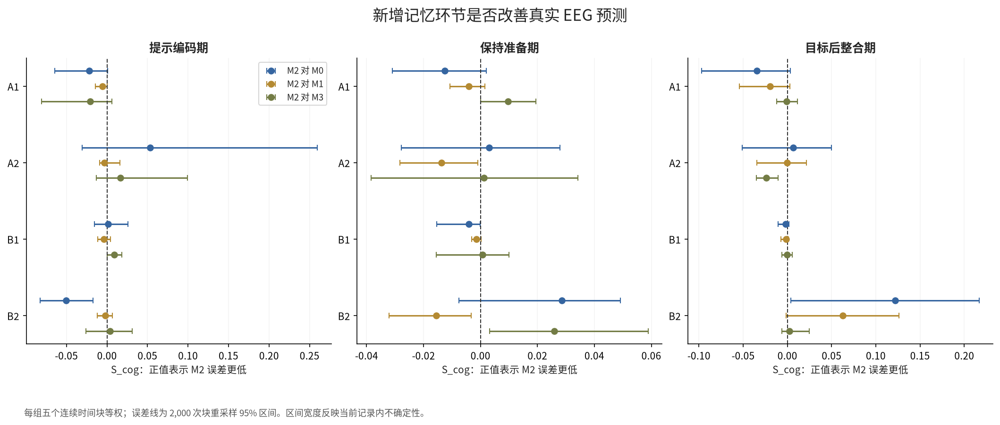
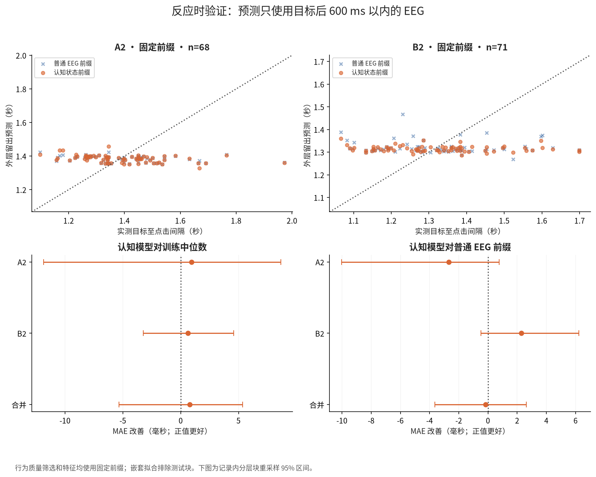
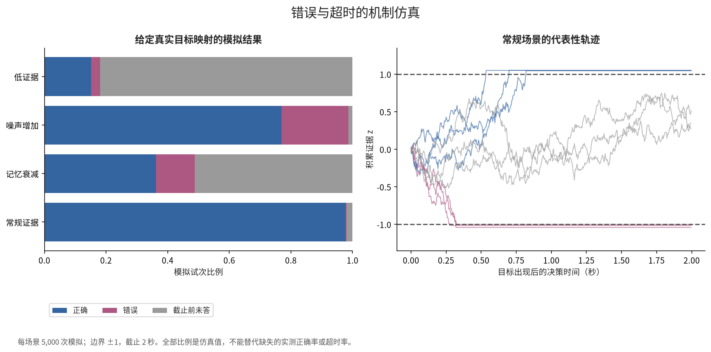
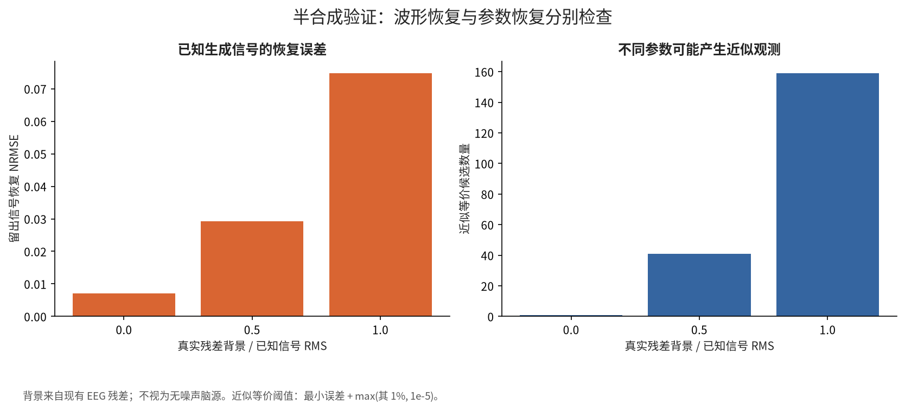
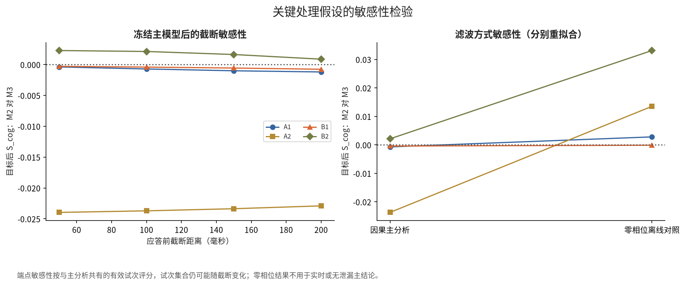

# 图表说明

统一使用白底、深灰文字；蓝色视觉/普通基线、橙色完整模型、橄榄色慢趋势，线型和点型提供非颜色区分。来源均为本目录保存的数值结果，输出采用 Matplotlib 静态 PNG 与 PDF。

## 01_事件时间轴

问题：事件时刻是否被混同。解释范围：400 个试次；明确独立点击与代理终点。

## 02_宏观模型与内部活动

问题：模型是否形成视觉、保持与提取活动。解释范围：固定参数仿真，非实测脑区活动。

## 03_三阶段EEG留出预测

问题：模型能否预测完整认知波形。解释范围：外层留出均值与逐点区间。

## 04_左右差分留出预测

问题：方向差分能否转移到留出块。解释范围：右减左；条件样本数不足处不绘制。

## 05_认知增量与对照

问题：记忆环节是否优于基础与慢趋势。解释范围：S_cog 与块重采样区间。

## 06_反应时预测与增量

问题：认知状态是否含额外行为信息。解释范围：固定前缀，独立质量筛选，嵌套留块。

## 07_正确错误与超时仿真

问题：机制是否能够产生三种结局。解释范围：模拟目标真值与截止时间；非实测错误率。

## 08_半合成恢复与可辨识性

问题：波形与参数是否都能恢复。解释范围：已知信号加真实残差背景。

## 09_截断与滤波敏感性

问题：结论是否依赖预处理选择。解释范围：冻结端点评分与独立重拟合分别说明。

