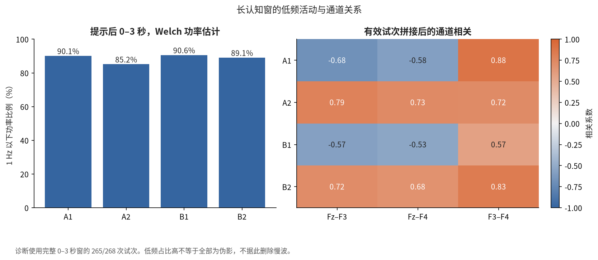
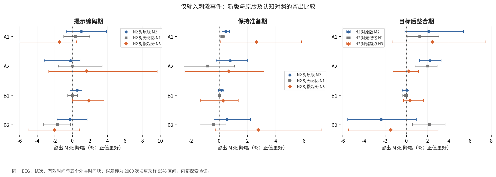
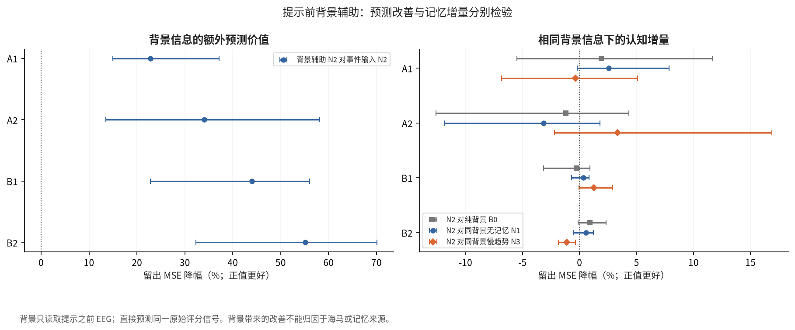
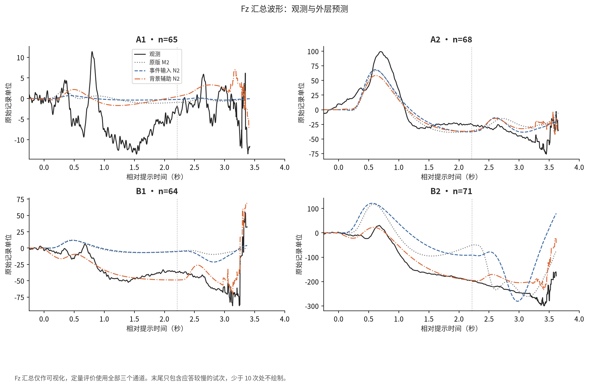
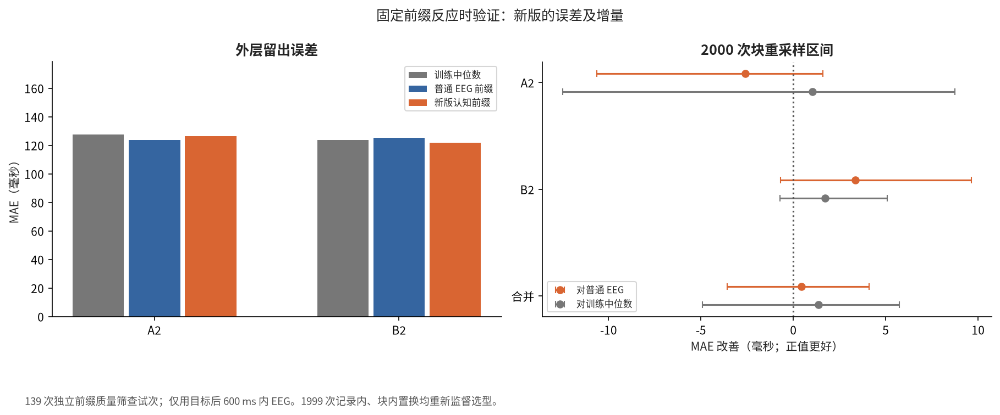
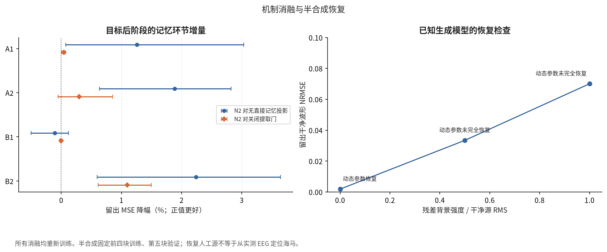

# 第三问 V2 优化与验证报告

## 优化结论

已完成一轮有依据的结构优化，原 `q3_result` 全部保留。新版与原版使用同一 268 个有效 EEG 试次、同一信号、评分时点和五块划分；行为另用 139 个固定前缀试次。模型与观测改动不会通过更强滤波或删除难预测试次人为降低误差。

仅输入刺激事件时，目标后阶段新版 N2 相对原版 M2 的 MSE 点估计在 **3/4** 组下降，块重采样 95% 区间完全高于零的有 **1/4** 组。新版认知前缀反应时 MAE 为 **0.1241 秒**，相对普通 EEG 前缀改善 **0.43 ms**，区间 **[-3.58, 4.11] ms**。

这些比较区分三个问题：新版是否比原版预测更好、背景能否解释误差、记忆模块是否优于相同信息下的普通慢响应。前两项的改善不能代替第三项，也不能证明海马来源已恢复。原题要求建立模型并用数据验证，并未要求四组显著改善或反应时预测必须成功；后者是额外支持证据。

提示前背景辅助使四组目标后阶段的留出 MSE 分别下降 **22.8%、34.1%、44.0%、55.1%**（相对于新版仅输入事件的 N2；具体区间见下文）。这是输入信息增加后对背景的预测收益，不能表述为记忆机制本身提高了这些比例。相同背景条件下，N2 没有稳定超过 N3；行为优势的区间也包含零。

## 诊断与修改依据

| dataset | n_trials | n_diagnostic_trials | power_le_1Hz | common_energy_fraction | corr_Fz_F3 | corr_Fz_F4 | corr_F3_F4 |
| --- | --- | --- | --- | --- | --- | --- | --- |
| A1 | 65 | 64 | 0.9014 | 0.5430 | -0.6806 | -0.5809 | 0.8842 |
| A2 | 68 | 68 | 0.8518 | 0.7975 | 0.7871 | 0.7336 | 0.7215 |
| B1 | 64 | 62 | 0.9063 | 0.2127 | -0.5715 | -0.5331 | 0.5692 |
| B2 | 71 | 71 | 0.8908 | 0.8251 | 0.7172 | 0.6770 | 0.8304 |

诊断仅纳入具有完整 0–3 秒评分窗的 265 次试次（A1/A2/B1/B2 为 64/68/62/71），并非改动主分析的 268 次队列。1 Hz 以下功率占比来自提示后 0–3 秒 Welch 估计；窗长和频率分辨率限制了解释。这些慢变化可能包括背景、伪影与认知成分，不能全部当作伪影删除。A1/B1 的额中与额侧相关为负，也不支持对所有记录统一减去三通道平均值。

事件定义沿用原审计：平台起点只是候选目标时刻；Task-1 无独立点击，Task-2 才有 ±2 标记。B1 第 49/87 次符号不一致不自动判错，正确性与超时保持未知。现有资料不足以重新确证这些语义，因此未为提高分数而改写标记。

## 改进后的宏观模型

由 Q2 的形状编码、LGN、E/I 群体和突触响应分别形成提示驱动 vᶜ 与共同目标驱动 vᵀ。共同提示成分与朝向差分分开投影；目标只采用共同输入，不使用点击方向或应答时长。与原版相比，目标活动不再写入需要保持的旧提示记忆。

$$\tau_m\dot m=-m+v^c,\qquad
\tau_p\dot p^c=-p^c+v^c+G_T(t)m(t-\delta),\qquad
\tau_p\dot p^T=-p^T+v^T.$$

$$\widehat x=L_v[v^c,v^T]+L_mm+L_p[p^c,p^T].$$

共同/差分提示各一个记忆状态，目标有独立整合状态；不同列的有效观测系数由训练数据估计。δ 固定 50 ms、反馈固定为零、提取增益固定为 1，避免与混合幅度同时自由变化。这是简化假设，不是测出的生理常数。τm 取 0.5/1/2/4 秒，τp 取 0.1/0.3/0.6 秒。

目标输入持续时间 0.1/0.2/0.4 秒在训练内选型，只表示未知显示过程的敏感性候选。方向成分相对共同成分的岭惩罚倍率为 1/10，允许弱方向成分更强收缩。所有模拟神经信号施加与实际 EEG 相同的因果观测滤波；保持原 V1 评分目标。

N0 为视觉模型；N1 添加普通低通而没有记忆；N2 为完整模型；N3 为一般慢趋势。无直接记忆投影、关闭提取门、固定目标时长 200 ms、固定等强度惩罚各自重新训练。内层先对完整候选网格作岭筛查，前两组用 Huber IRLS 重拟合选型。外层测试块不参与缩放或参数估计。

## 真实 EEG 的新旧对照

以下为目标后阶段，S=1−MSE_N2/MSE_对照，五个块等权，正值更好。95% 区间来自 2000 次时间块重采样；未作多重区间校正，不能等同于独立受试者总体置信区间。

| dataset | control | S | ci_low | ci_high |
| --- | --- | --- | --- | --- |
| A1 | N0 | -0.0050 | -0.0161 | 0.0033 |
| A1 | N1 | 0.0127 | 0.0008 | 0.0306 |
| A1 | N3 | 0.0244 | -0.0134 | 0.0742 |
| A1 | V1_M2 | 0.0207 | -0.0014 | 0.0536 |
| A2 | N0 | 0.0283 | -0.0278 | 0.0675 |
| A2 | N1 | 0.0201 | 0.0082 | 0.0290 |
| A2 | N3 | 0.0022 | -0.0125 | 0.0114 |
| A2 | V1_M2 | 0.0222 | 0.0124 | 0.0328 |
| B1 | N0 | -0.0013 | -0.0086 | 0.0031 |
| B1 | N1 | -0.0007 | -0.0035 | 0.0010 |
| B1 | N3 | 0.0034 | -0.0028 | 0.0163 |
| B1 | V1_M2 | 0.0003 | -0.0039 | 0.0026 |
| B2 | N0 | 0.1012 | 0.0123 | 0.1728 |
| B2 | N1 | 0.0219 | 0.0057 | 0.0365 |
| B2 | N3 | -0.0148 | -0.0547 | 0.0298 |
| B2 | V1_M2 | -0.0237 | -0.0553 | 0.0093 |

仅输入事件的绝对预测分数如下。S_train_baseline 使用训练集各阶段平均电位作为基线；正值才优于该基线，不能仅凭新旧相对降幅判断预测充分。

| dataset | stage | RMSE | NRMSE | S_train_baseline |
| --- | --- | --- | --- | --- |
| A1 | encoding | 120.0451 | 0.5405 | -0.0239 |
| A1 | maintenance | 258.7320 | 1.1572 | 0.0457 |
| A1 | retrieval | 285.2370 | 1.3241 | 0.0129 |
| A2 | encoding | 205.8104 | 0.6888 | 0.0467 |
| A2 | maintenance | 320.0776 | 1.0968 | 0.0355 |
| A2 | retrieval | 340.9348 | 1.1686 | 0.0126 |
| B1 | encoding | 162.6018 | 0.6203 | 0.0076 |
| B1 | maintenance | 302.8910 | 1.1519 | 0.0249 |
| B1 | retrieval | 321.3248 | 1.2276 | 0.0013 |
| B2 | encoding | 279.5732 | 0.6655 | -0.0196 |
| B2 | maintenance | 450.0367 | 1.1031 | 0.0223 |
| B2 | retrieval | 450.2137 | 1.1243 | -0.0039 |

固定目标时长和等惩罚对照用于检查新增自由度是否值得保留，不按外层结果再挑选一个“最终赢家”。完整消融、参数及来源系数见 `intervals.csv`、`selected_parameters.csv`、各组 `*_choices.json`；方向条件及右减左差分误差见 `*_contrasts.csv`。方向已知输入下的波形预测不等于未知朝向分类。

## 提示前背景辅助预测

该附加设定显式允许使用提示前 EEG，因此与仅输入事件的预测分开报告。读取每次提示之前最多 8 秒的因果滤波数据，在 0.25/1/4 秒尺度估计历史斜率 d；外推项采用 dτ(1−exp(−t/τ))，所有系数仍仅由训练块估计。背景项直接定义在已滤波观测域，不解释为神经源；不使用提示后的实际 EEG 更新背景。

| dataset | S | ci_low | ci_high |
| --- | --- | --- | --- |
| A1 | 0.2278 | 0.1494 | 0.3710 |
| A2 | 0.3407 | 0.1353 | 0.5812 |
| B1 | 0.4397 | 0.2284 | 0.5603 |
| B2 | 0.5512 | 0.3228 | 0.7005 |

上述表只衡量背景信息的预测价值。纯背景 B0、视觉 N0、无记忆 N1、完整 N2 和慢趋势 N3 都获得相同背景输入，记忆证据必须来自它们之间的比较。

| dataset | control | S | ci_low | ci_high |
| --- | --- | --- | --- | --- |
| A1 | B0 | 0.0191 | -0.0548 | 0.1166 |
| A1 | N1 | 0.0258 | -0.0018 | 0.0785 |
| A1 | N3 | -0.0035 | -0.0682 | 0.0508 |
| A2 | B0 | -0.0120 | -0.1259 | 0.0432 |
| A2 | N1 | -0.0316 | -0.1188 | 0.0178 |
| A2 | N3 | 0.0331 | -0.0219 | 0.1685 |
| B1 | B0 | -0.0027 | -0.0315 | 0.0093 |
| B1 | N1 | 0.0033 | -0.0070 | 0.0083 |
| B1 | N3 | 0.0126 | -0.0004 | 0.0292 |
| B2 | B0 | 0.0093 | -0.0012 | 0.0233 |
| B2 | N1 | 0.0058 | -0.0053 | 0.0121 |
| B2 | N3 | -0.0113 | -0.0184 | -0.0035 |

图中观测是跨试次汇总；尾部仅含应答较慢的试次，不把均值尾部变化直接解释为所有试次的神经演化。

## 行为验证与机制消融

行为保留原固定前缀队列，最后纳入目标后 597.65625 ms 的采样点。每个行为内层重新用其训练块前缀 EEG 选择 N2 动力学与读出矩阵；从前缀估计少量源幅度，构造记忆水平、认知水平、变化率及保持量变化。监督岭回归预测 log(RT)，与相同前缀的普通九维 EEG 均值特征和训练 RT 中位数比较。没有使用完整应答窗长度或应答锁定坐标。

| dataset | model | n | MAE | R2 | S_vs_train_median | spearman |
| --- | --- | --- | --- | --- | --- | --- |
| A2 | median | 68 | 0.1275 | -0.1474 | 0.0000 | -0.3365 |
| A2 | ordinary | 68 | 0.1239 | -0.1010 | 0.0404 | -0.3558 |
| A2 | cognitive | 68 | 0.1265 | -0.1475 | -0.0001 | -0.3539 |
| B2 | median | 71 | 0.1236 | -0.0104 | 0.0000 | -0.0231 |
| B2 | ordinary | 71 | 0.1252 | -0.0653 | -0.0543 | -0.0778 |
| B2 | cognitive | 71 | 0.1219 | -0.0176 | -0.0071 | -0.0747 |
| pooled | median | 139 | 0.1255 | -0.0261 | 0.0000 | 0.1191 |
| pooled | ordinary | 139 | 0.1246 | -0.0302 | -0.0040 | 0.0570 |
| pooled | cognitive | 139 | 0.1241 | -0.0296 | -0.0034 | 0.0777 |

| dataset | contrast | MAE_gain | p_raw | p_Holm_6 |
| --- | --- | --- | --- | --- |
| A2 | cognitive_vs_median | 0.0010 | 0.9105 | 1.0000 |
| A2 | cognitive_vs_ordinary | -0.0026 | 0.9165 | 1.0000 |
| B2 | cognitive_vs_median | 0.0017 | 0.5135 | 1.0000 |
| B2 | cognitive_vs_ordinary | 0.0033 | 0.1100 | 0.6600 |
| pooled | cognitive_vs_median | 0.0014 | 0.8225 | 1.0000 |
| pooled | cognitive_vs_ordinary | 0.0004 | 0.4415 | 1.0000 |

相对原版行为模型的配对比较：

| dataset | V1_MAE | V2_MAE | gain | ci_low | ci_high |
| --- | --- | --- | --- | --- | --- |
| A2 | 0.1266 | 0.1265 | 0.0001 | -0.0009 | 0.0009 |
| B2 | 0.1230 | 0.1219 | 0.0011 | -0.0006 | 0.0035 |
| pooled | 0.1247 | 0.1241 | 0.0006 | -0.0004 | 0.0018 |

| noise_ratio | NRMSE_clean | exact_parameters | tau_m | tau_p | target_duration | direction_penalty |
| --- | --- | --- | --- | --- | --- | --- |
| 0.0000 | 0.0018 | True | 1.0000 | 0.3000 | 0.2000 | 1.0000 |
| 0.5000 | 0.0334 | False | 4.0000 | 0.3000 | 0.2000 | 10.0000 |
| 1.0000 | 0.0701 | False | 4.0000 | 0.3000 | 0.1000 | 10.0000 |

半合成实验固定前四块训练、第五块验证。真实 EEG 残差只作有结构的噪声背景，已知真值仅是人工生成部分；三种噪声强度不是三名受试者。动态参数准确恢复与预测波形误差分别报告，不将其中一项替代另一项。

错误与未及时应答的证据积累机制保持原模型设计，见 [原版决策仿真](../q3_result/第三问_建模与验证报告.md)。这些仍是已知目标映射下的机制仿真，新版没有补造实测正确率或超时率，也没有把原版仿真伪称为新版拟合结果。

## 论文表述与边界

本轮优化修正了提示保持与新目标输入混用的问题，收缩了难辨识自由参数，并通过相同观测下的对照区分背景预测与认知机制增量。应按上述分组表描述改善范围，不将局部改善写成全面成功。只有三路额区 EEG、两名受试者；记忆状态具有功能解释，不等于实际恢复海马信号。

这是在已反复查看的数据上的内部探索优化。即使某个区间完全高于零，也需要新试次或新受试者验证，不能作为疾病诊断依据。没有因为原版表现差而降低检查标准，也不要求把真实负结果改成正结果。

## 复现与文件

代码及事先固定的工程方案见 [V2 复现说明](../q3/v2/README.md)。入口为 `OPENBLAS_NUM_THREADS=1 .venv/bin/python -B q3/v2/run.py`。独立审计入口为 `q3/v2/audit.py`。

`*_waves.npz` 保存观测和外层预测；`*_choices.json` 保存训练试次、选型与系数；`manifest.json` 保存来源哈希。旧结果未覆盖。六组新图同时提供 PNG 与矢量 PDF。
