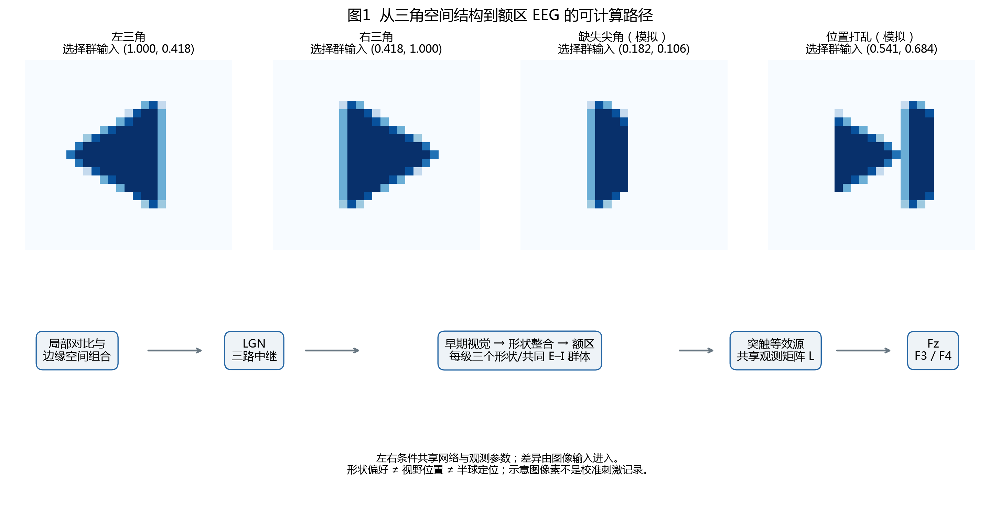
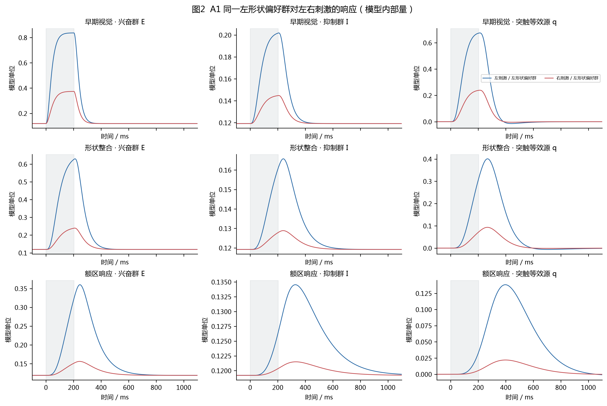
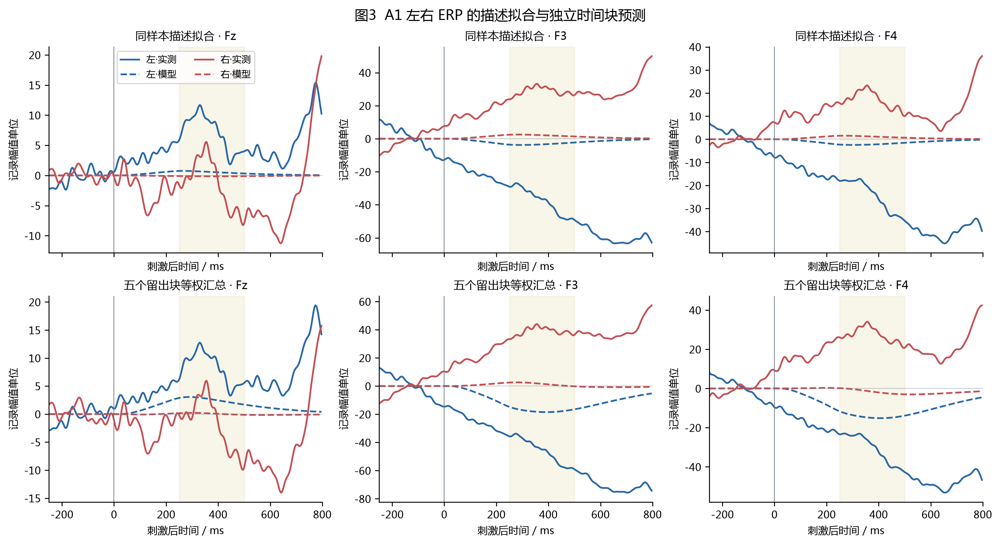
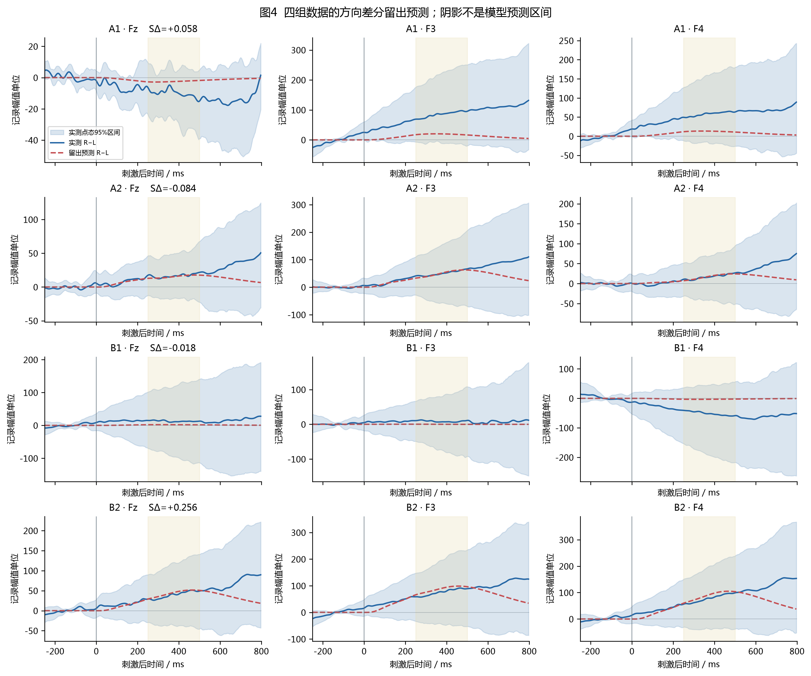
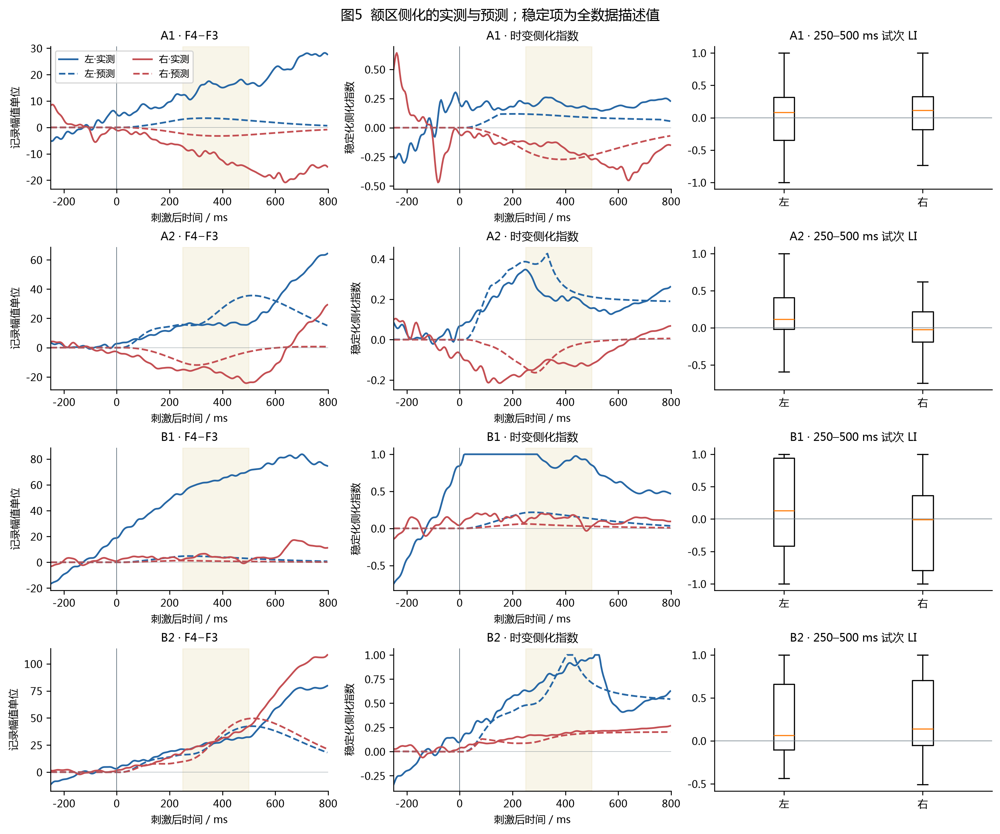
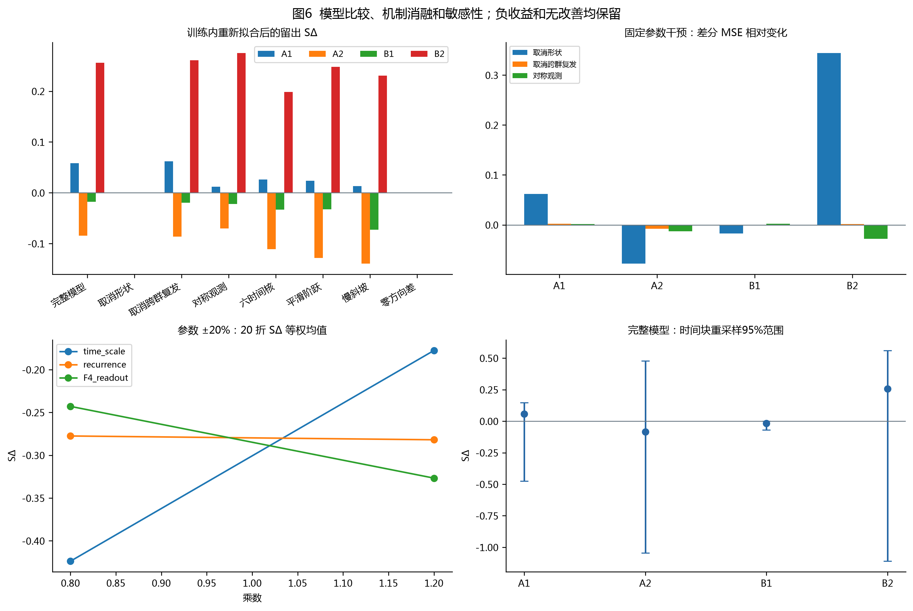
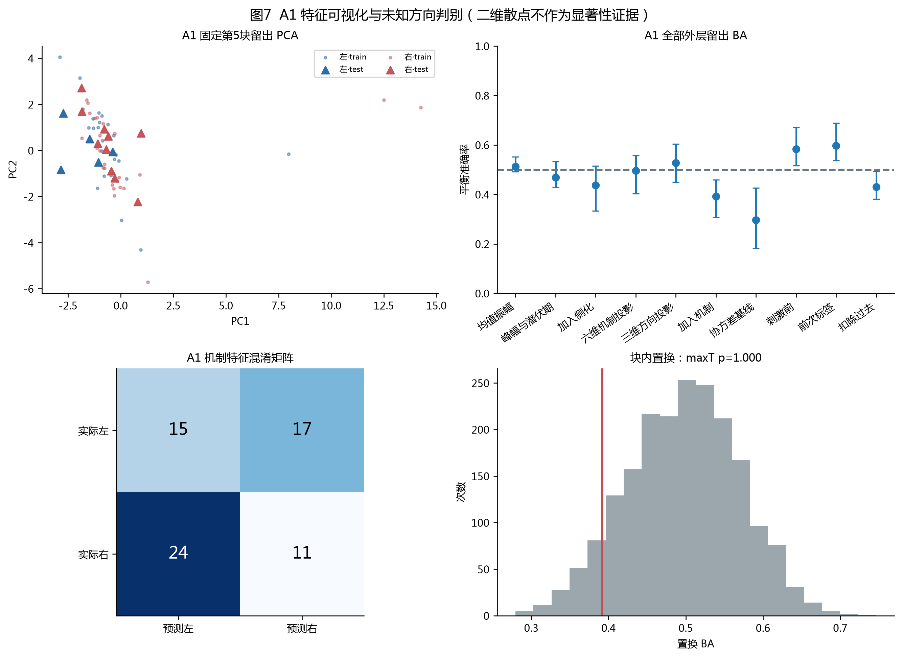

# 第二问 图像驱动的脑电形成模型与视觉响应表示

本文构建图像驱动的三级兴奋—抑制群体模型，将三角形边缘的空间组合、LGN中继、皮层动态和额区头皮观测连接起来。四组原始记录经独立时间块处理后保留275次试验；方向差分预测在2/4组优于零差基线。23维机制增强特征的合并留出平衡准确率为44.7%（时间块重采样95%区间40.2%–48.4%），AUC为0.468，块内置换七特征组合maxT校正p=0.9995。这些结果评估的是候选机制的解释与预测能力，不构成真实神经源的唯一识别。

## 数据与验证设计

数据为两名受试者、两个项目的四份记录，采样率256 Hz，实际EEG通道顺序为Fz/F3/F4。左、右指三角朝向，不推定左右视野。严格主分析各组保留数量为{'A1': 67, 'A2': 70, 'B1': 69, 'B2': 69}。每份记录按原始事件划分五个连续块，块内单独滤波，边界保护24 s，截取−250至约800 ms，使用刺激前中位数作基线。三窗50–250、250–500、500–750 ms在机制损失中等权。外层测试块不参与模型选择，内层再留块选择时间尺度、复发强度和岭正则。内层选择JSON中的损失省略了所有候选共有的目标能量常数，因而可能为负；这些数值只用于候选排序，不是负的均方误差。Q1 before/v7仅用于已知条件描述性衔接；V7方向知情模板不进入主判别。幅值使用原始记录单位，未假定已标定为微伏。

## 形状编码与群体模型

采用COSFIRE思想的简化边缘空间组合编码[1]，从题目示意图提取三角并镜像，建立两个形状偏好模板与共同注视输入。缺角与位置打乱是计算机反事实刺激，不是新增实验。三级群体动力学采用Wilson–Cowan型E/I方程[2]，分别表示早期视觉、形状整合和额区响应，每级三个群体。LGN状态表示中继信号在预设空间通路上的投影，不声称LGN细胞本身完成三角形识别；形状偏好由后续皮层输入的空间组合权重表示。采用突触等效源而非直接把放电率当成EEG；源与头皮观测的关系参考EEG计算模型综述[3]。所有常数、拓扑和阶段名称均为候选模型假设。

\[
f_j(I)=\exp\left[\frac1K\sum_{k=1}^{K}\log\left(\max_{\delta\in\mathcal N}r_{\theta_{jk}}(p_{jk}+\delta;I)+\epsilon\right)\right],\quad j\in\{L,R\}.
\]
\[
\tau_g\dot g=-g+3f(I)\mathbf1_{0\le t<T_s},\quad
\tau_{E,s}\dot E_s=-E_s+\sigma(E_s-I_s+\rho WE_s+d_s-2),\quad
\tau_{I,s}\dot I_s=-I_s+\sigma(E_s-I_s-2),
\]
其中 \(d_1=g\)、\(d_s=3(E_{s-1}-E_{s-1,0})\)，\(W\) 的对角元为0、非对角元为1/2；所有方向共享参数。
\[
\tau_{e,s}\dot u_{e,s}=E_s-E_{s,0}-u_{e,s},\quad
\tau_{e,s}\dot v_{e,s}=u_{e,s}-v_{e,s},\quad q_s=v_{e,s}-0.7v_{i,s},\qquad \hat y_d=L\tilde q_d.
\]
抑制突触使用同构方程。\(\tilde q\) 是在256 Hz采样率下施加与EEG一致的观测滤波和基线处理的源；神经状态本身保持因果，零相位观测滤波可产生刺激前延展。
\[
\hat L=\arg\min_L\left\{\frac12\|C_y-LC_q\|_W^2+\frac12\|D_y-LD_q\|_W^2+\lambda\|L\|_F^2\right\},\quad
C_y=(y_R+y_L)/2,\ D_y=y_R-y_L.
\]
上式范数按时间窗加权；各源列在共同与差分联合设计中归一化，避免尺度改变正则含义。
\[
S_\Delta=1-\frac{\operatorname{MSE}(D^{obs},D^{pred})}{\operatorname{MSE}(D^{obs},0)},\qquad
R^2=1-\frac{\sum(y-\hat y)^2}{\sum(y-\bar y)^2}.
\]
\[
LI=\frac{A_{F4}-A_{F3}}{\max(|A_{F4}|+|A_{F3}|,\epsilon_{train})},\qquad
\phi=[A_{1:3},P_{1:3},T_{1:3},M_{1:3},LI,A_{F4}-A_{F3},b_{1:6},e_{1:3}]\in\mathbb R^{23}.
\]

## 机制拟合与实测差异

| dataset | S_delta | S_low | S_high | delta_RMSE | R2 | Corr |
| --- | --- | --- | --- | --- | --- | --- |
| A1 | 0.0581 | -0.4743 | 0.1474 | 91.1154 | -0.1825 | -0.5342 |
| A2 | -0.0842 | -1.0452 | 0.4769 | 87.6182 | 0.1283 | 0.4166 |
| B1 | -0.0176 | -0.0699 | -0.0004 | 98.3928 | -0.1027 | -0.1545 |
| B2 | 0.2562 | -1.1102 | 0.5607 | 90.6075 | -0.1176 | 0.1193 |

SΔ的零基线对应左右无差异预测，与去均值定义的R²不同。总ERP的良好拟合不能替代方向差分的留出检验。表内区间重采样已有五个时间块，属于当前记录的描述性范围，不是五项独立研究或人群置信区间。完整模型、共同响应、六时间核、平滑阶跃和慢斜坡使用同样划分；其可拟合参数数目不同，比较解释为留出预测比较，不能称为严格等自由度机制鉴别。

## 消融与参数敏感性

固定参数消融保持训练得到的观测矩阵与源归一化尺度，分别取消形状选择性、复发连接或头皮左右投影差异。其中取消复发指令同级跨群体耦合系数ρ=0，局部E/I反馈仍保留。重新拟合消融则在同一内外层划分中重新选择其余参数，检验剩余结构是否足以补偿。取消形状选择后左右模拟相同、对称观测后F3/F4一致，是实现必须满足的结构性约束；并不因此证明实测差异必由此机制产生。对时间尺度、复发强度及F4观测行做±20%扰动，报告留出误差变化和静息稳定性。复发强度选为0时，乘法扰动保持0，不能解释为已证明低敏感性。

## 特征表示及有效性

基础特征从250–500 ms提取三通道均值、有效正峰幅度和潜伏期。正峰要求为窗内局部极大值、幅度大于0且显著度至少为刺激前标准差的一半；无峰记缺失，训练中位数补缺并保留缺失标记。侧化指数使用训练分母10%分位数稳定。机制特征把未知试次投影到训练拟合的共同和方向差分模板，保存各通道两项投影系数及残差RMS，共23维。新增六维投影和三维方向投影固定对照，均仅由训练折建立模板；它们与原五组特征一起接受maxT校正，未按外层成绩挑选表示。它不需要未知试次的真实方向。模型时间窗特征不等于已确认的P300来源。

| features | BA | BA_low | BA_high | AUC | F1 | block_permutation_p | block_permutation_maxT_p |
| --- | --- | --- | --- | --- | --- | --- | --- |
| amplitude | 0.5161 | 0.4846 | 0.5481 | 0.5337 | 0.5056 | 0.3125 | 0.7855 |
| peak_latency | 0.4690 | 0.4200 | 0.5159 | 0.4663 | 0.4632 | 0.8165 | 0.9960 |
| spatial | 0.4693 | 0.4332 | 0.5004 | 0.4721 | 0.4710 | 0.8035 | 0.9960 |
| mechanism | 0.4471 | 0.4016 | 0.4837 | 0.4679 | 0.4370 | 0.9175 | 0.9995 |
| covariance | 0.4692 | 0.4221 | 0.5208 | 0.4770 | 0.4672 | 0.7945 | 0.9960 |
| projection6 | 0.4840 | 0.4521 | 0.5205 | 0.4896 | 0.4892 | 0.6825 | 0.9795 |
| direction3 | 0.4919 | 0.4451 | 0.5378 | 0.4632 | 0.5139 | 0.5775 | 0.9535 |
| past_only | 0.5242 | 0.4822 | 0.5667 | 0.4851 | 0.5338 | 0.2370 | — |
| previous_cue | 0.5448 | 0.5010 | 0.5911 | 0.5013 | 0.5247 | 0.1505 | — |
| post_given_past | 0.4847 | 0.4393 | 0.5269 | 0.4957 | 0.5069 | 0.6720 | — |

加入机制相对空间特征的BA差为-2.2%，成对时间块重采样区间为[-4.9%,+0.3%]。扣除刺激前可线性预测部分后，BA为48.5%、AUC为0.496。Precision、Recall和F1以右刺激为正类。PCA只用固定前四块拟合，不能据散点分离程度作显著性判断。

## 统计检验与迁移

执行1999次“记录×时间块”内标签置换；每次重新选择机制参数、拟合模板与分类器。七项特征组合的BA采用maxT校正，并补充199次记录内非零循环移位。循环移位后若某留出块只剩一类，按预先规定的可估计条件重新抽取，故该检验为条件随机化敏感性分析。判别区间对已经生成的折外预测进行时间块重采样，没有在每次重采样中重新训练；它不包含完整的模型训练不确定性。maxT覆盖本次七个特征组合，不覆盖此前反复开发过的全部模型，也不自动校正跨数据组选择。另提供同项目A→B与B→A迁移，不使用测试受试者的均值或尺度拟合标准化。仅两名受试者，迁移结果不能外推为人群泛化。

| train | test | BA | AUC | F1 |
| --- | --- | --- | --- | --- |
| A1 | B1 | 0.6231 | 0.5807 | 0.6176 |
| B1 | A1 | 0.4746 | 0.5232 | 0.5205 |
| A2 | B2 | 0.5557 | 0.5270 | 0.5373 |
| B2 | A2 | 0.5442 | 0.5341 | 0.5000 |

## 五项命题的证据判定

| 命题 | 判定 | 证据 | 可写结论 |
| --- | --- | --- | --- |
| 形状产生不同输入 | 模型内支持 | 图1及形状响应表 | 镜像输入交换形状选择群响应；并非实测皮层放电。 |
| 群体活动形成头皮观测 | 构建完成 | 图1–3及参数表 | 同一观测矩阵作用于两种输入；矩阵不是个体解剖导联。 |
| 重现实测方向差异 | 部分支持 | 图3–4及机制汇总 | 四组中2组留出 SΔ>0；具体幅度与区间必须逐组报告。 |
| 关键机制贡献 | 模型内支持；生理归因未确认 | 图6、固定消融及重拟合对照 | 形状取消使差异消失是结构性检验；真实来源需优于替代解释。 |
| 稳定特征区分能力 | 尚未支持 | 图7及表4 | 机制特征 BA=0.447，AUC=0.468，七组合校正 p=0.9995。 |

三路额区EEG、未知真实头模型和缺少同步眼位/EOG，使视觉源、眼动和任务准备的贡献不能唯一分解。本研究的贡献是可计算、可消融、可验证的候选形成模型与明确的试次特征；证据不足的命题保留其不确定性。

## 复现

完整运行：`python -B q2/main.py`。重绘及生成论文文字：`python -B q2/main.py --redraw`。快速检查使用`--quick`，不可将其低置换次数结果替代正式分析。全部新文件直接位于q2_result根目录。Q2_运行清单.json保存版本与哈希，Q2_结果复核.json保存从逐试次输出重算指标的核验结果。

## 参考文献

[1] Azzopardi G, Petkov N. Ventral-stream-like shape representation: from pixel intensity values to trainable object-selective COSFIRE models. Front Comput Neurosci, 2014, 8:80. https://doi.org/10.3389/fncom.2014.00080

[2] Wilson HR, Cowan JD. Excitatory and inhibitory interactions in localized populations of model neurons. Biophys J, 1972, 12:1–24. https://doi.org/10.1016/S0006-3495(72)86068-5

[3] Glomb K, et al. Computational Models in Electroencephalography. Brain Topogr, 2022, 35:142–161. https://doi.org/10.1007/s10548-021-00828-2

## 四类论文表

### 表1 模型参数与来源

| parameter | meaning | value | unit | source |
| --- | --- | --- | --- | --- |
| tau_LGN | LGN 中继时间常数 | 20 × scale | ms | 模型假设 |
| tau_E | 三级兴奋时间常数 | 20,40,80 × scale | ms | 模型假设 |
| tau_I | 三级抑制时间常数 | 40,80,160 × scale | ms | 模型假设 |
| tau_syn_E | 三级兴奋双低通突触核 | 25,50,100 × scale | ms | 模型假设 |
| tau_syn_I | 三级抑制双低通突触核 | 75,150,300 × scale | ms | 模型假设 |
| w_EE,w_EI,w_IE,w_II | 局部 E/I 耦合 | 1,1,1,1 | 无量纲 | 模型假设 |
| feedforward,input | 级间偏离静息驱动及输入增益 | 3,3 | 无量纲 | 模型假设 |
| bias,inhibitory_weight | sigmoid 偏置和抑制突触权重 | -2,0.7 | 无量纲 | 模型假设 |
| scale | 全局时间尺度 | 0.75,1,1.25 | 无量纲 | 训练内留块选取 |
| recurrence | 同级对称交互强度 | 0,0.1,0.2 | 无量纲 | 训练内留块选取 |
| lambda | 有效观测矩阵岭正则 | 0.1,0.3,1,3,10,30,100 | 归一化源单位 | 训练内留块选取 |
| L | 条件共享的 3×9 有效观测矩阵 | 岭回归；不反演解剖坐标 | 记录幅值单位/归一化源 | 仅训练ERP估计 |
| duration | 模拟视觉输入时长 | 52/256；实测另有53/256 | s | 事件记录代表值 |
| geometry | 图像形状输入 | 题图像素、镜像；不等于实际视角 | 示意图像素 | 题图及模型构造 |
| fs,bandpass,notch | 采样与观测滤波 | 256;0.1–30;60(Q=30) | Hz | 采样率实测；滤波固定 |
| guard,baseline | 时间块保护及基线 | 24 s；刺激前250 ms中位数 | s,ms | 固定方案 |
| LDA_shrinkage | 协方差收缩强度 | 0.8 | 无量纲 | 固定，未按测试分数优化 |

### 表2 完整模型逐方向逐通道留出结果

各指标为五个留出块的算术平均；RMSE、R²、相关的平均值与先合并波形后计算不同。

| dataset | condition | channel | RMSE | R2 | Corr |
| --- | --- | --- | --- | --- | --- |
| A1 | Left | F3 | 71.8321 | -15.5980 | -0.3312 |
| A1 | Left | F4 | 79.9133 | -10.6265 | -0.0694 |
| A1 | Left | Fz | 12.1778 | -1.5281 | 0.0438 |
| A1 | Right | F3 | 90.5800 | -7.5708 | 0.0616 |
| A1 | Right | F4 | 89.0041 | -6.8726 | 0.0603 |
| A1 | Right | Fz | 14.3863 | -2.2508 | -0.1890 |
| A2 | Left | F3 | 63.2921 | -2.6590 | 0.5994 |
| A2 | Left | F4 | 52.0139 | -0.1444 | 0.6130 |
| A2 | Left | Fz | 30.6667 | 0.3694 | 0.6597 |
| A2 | Right | F3 | 79.0016 | -2.2690 | 0.6390 |
| A2 | Right | F4 | 62.4172 | 0.1569 | 0.6257 |
| A2 | Right | Fz | 46.0499 | 0.0426 | 0.6210 |
| B1 | Left | F3 | 33.4349 | -0.6002 | -0.0113 |
| B1 | Left | F4 | 79.7048 | -2.6489 | -0.4062 |
| B1 | Left | Fz | 40.4265 | -6.9232 | -0.2117 |
| B1 | Right | F3 | 47.4319 | -7.6929 | -0.2867 |
| B1 | Right | F4 | 60.2999 | -6.3619 | -0.3848 |
| B1 | Right | Fz | 55.3930 | -8.6068 | 0.0472 |
| B2 | Left | F3 | 111.3925 | -3.2153 | -0.0089 |
| B2 | Left | F4 | 115.8238 | -3.6109 | 0.2033 |
| B2 | Left | Fz | 87.7644 | -3.9591 | 0.2524 |
| B2 | Right | F3 | 84.4449 | -3.3852 | 0.3485 |
| B2 | Right | F4 | 98.1022 | -0.6963 | 0.4842 |
| B2 | Right | Fz | 71.9543 | -0.5764 | 0.4925 |

### 表3 特征定义

| feature | dimension | formula | meaning |
| --- | --- | --- | --- |
| amplitude | 3 | mean(X_c(t)), t in [250,500)ms | 关键窗有符号均值 |
| positive_peak | 3 | max valid local peak; prominence >= 0.5*prestim_SD; value>0 | 有效正峰幅值；不自动称为P300 |
| latency | 3 | time of selected valid peak (ms) | 有效峰潜伏期；无峰记缺失 |
| missing_flag | 3 | 1(no valid peak) | 缺失标记；填充值仅由训练折估计 |
| LI | 1 | (A_F4-A_F3)/max(|A_F4|+|A_F3|,train_q10) | 稳定化窗口侧化指数 |
| lateral_difference | 1 | A_F4-A_F3 | 有符号空间差值 |
| mechanism_projection | 6 | ridge projection onto train-fitted common and R-L templates, each channel | 条件未知也能计算；不是源定位 |
| projection6 | 6 | b_Fz_common,b_Fz_delta,b_F3_common,b_F3_delta,b_F4_common,b_F4_delta | 六维机制投影固定对照 |
| direction3 | 3 | b_Fz_delta,b_F3_delta,b_F4_delta | 三维方向投影固定对照 |
| mechanism_residual | 3 | RMS(X_c - reconstructed X_c), 50–750ms | 前向模板不能解释的剩余波动 |
| covariance_baseline | 24 | 4 windows x (3 log variances + 3 correlations) | 旧空间协方差基线 |
| past_only | 18 | first 6 DCT coefficients x 3 scalp modes | 仅刺激前信号 |
| previous_cue | 1 | direction of immediately preceding original trial | 序列对照；不使用当前方向 |
| post_given_past | 23 | mechanism features minus train-ridge prediction from past features | 扣除过去线性可预测信息 |

### 表4 特征判别

合并比较见上文；逐组完整指标、校正p值和区间见[表4 CSV](Q2_表4_特征判别.csv)。

## 正文图与图注

图1 图像驱动的脑电形成路径。上排为题图三角及构造的反事实形状，数值为模型输入响应；下排为共享动力学和观测关系。

图2 A1描述标定模型中，同一个左形状偏好群在左右刺激下的三级E/I及突触响应。右形状偏好群呈镜像互换；完整九群体状态存入NPZ，曲线均为模型内部量。

图3 A1左右ERP。上排为同样本描述拟合，下排为五个测试块预测与实测均值的等权汇总；实线为实测、虚线为模型。

图4 四组右减左差分留出预测。阴影为按块并在块内按方向重采样的实测点态95%区间，不是同时置信带或模型预测区间。

图5 F4−F3和稳定化LI。时变曲线比较实测与模型，箱线图为试次窗口LI；图中分母稳定项采用描述性全数据值，分类使用训练折值。

图6 重拟合消融、固定参数干预、参数扰动与差分预测收益。保留负收益，干预效应只作为候选模型内证据。

图7 A1训练参考PCA、留出BA、机制特征混淆矩阵和置换分布。PCA训练与测试点使用不同标记，显著性来自完整验证流程。