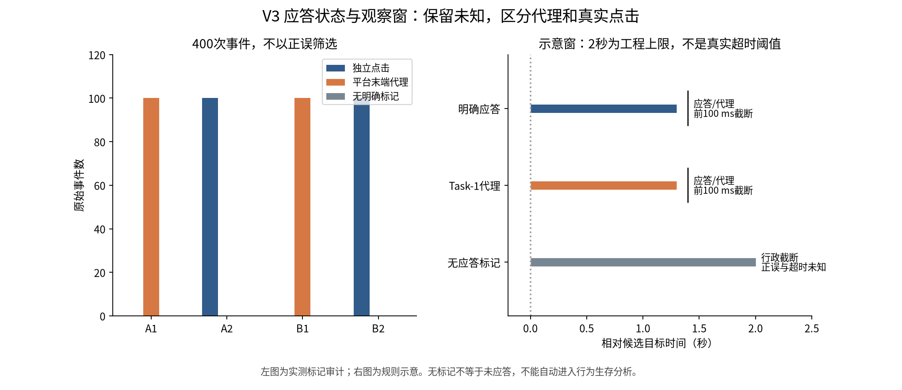
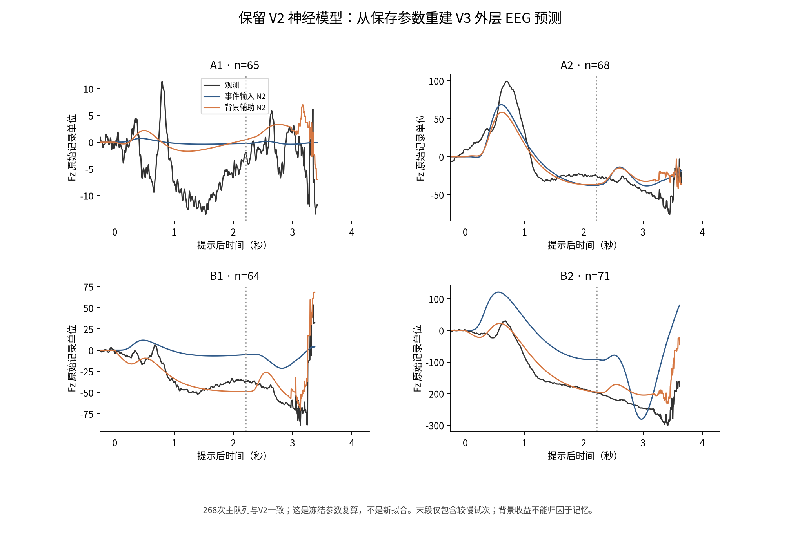
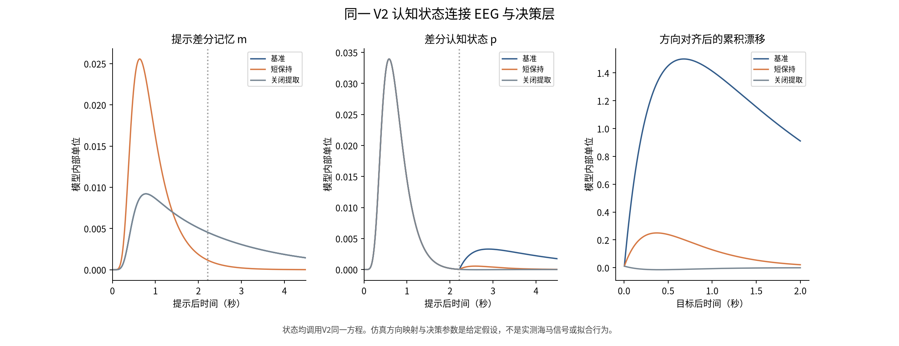
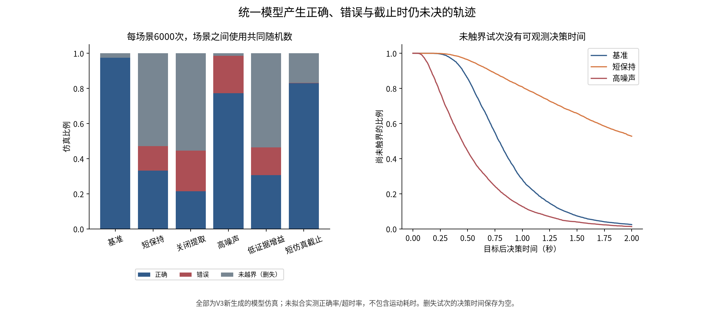
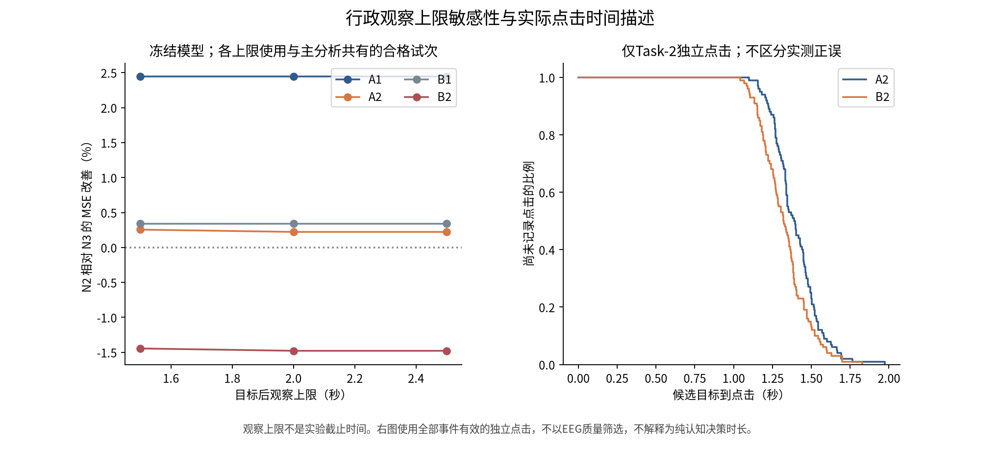

# 第三问 V3 认知模型与不确定应答处理

V3补齐了没有明确应答时的有限EEG观察窗，以及由同一V2认知状态驱动的正确、错误和未决行为仿真。神经模型与已拟合头皮读出保持V2定义，268次主EEG队列保持一致；新增内容不改变旧版预测成绩，也不将仿真结果写成实测行为准确率。

## 题目要求与事件证据

所有四份MAT的原始Fz/F3/F4、VisCue和TgtAct重新审计。±1平台起点仍仅是假设的目标出现，Task-1平台末端仍是应答代理；Task-2的±2为独立点击。正确目标映射和实验超时阈值没有提供，400次真实correctness和timeout保持未知。

| dataset | explicit_click | platform_end_proxy | EEG保留 |
| --- | --- | --- | --- |
| A1 | 0 | 100 | 65 |
| A2 | 100 | 0 | 68 |
| B1 | 0 | 100 | 64 |
| B2 | 100 | 0 | 71 |

有已知应答或代理时，EEG终点为应答前100 ms与行政观察上限的较早者。无明确应答时，只要提示和候选目标可识别，就允许在质量检查后保留至目标后2 s的EEG；记录长度、下一提示和24 s块保护仍限制可用范围。这个上限沿用既有决策示例的工程时间尺度，未经实验日志确证，1.5/2/2.5 s均提供敏感性结果。

错误、正确和未知正误使用同一截窗和质量规则，不能因为答错就删除认知过程。若完整记录中存在晚于人为观察上限的点击，则在该上限的时间分析中属于行政右删失；它不等同于实验超时。只有缺失标记而无法判断是否真的未应答的记录，标为“应答未知/可能标记缺失”，仅允许EEG分析，不自动进入有效生存删失统计。Task-1代理也不进入真实点击生存曲线。

当前200次Task-2均有独立点击，200次Task-1均仅有代理，未发现可确认的真实无应答案例。synthetic_marker_stress仅删除已有试次的点击标记来检验程序，真实EEG中可能仍有实际动作活动，因此这些压力样本不进入实测模型结论。额外的合成干净EEG单元测试验证了无应答标记并不会自动导致剔除。

## 统一的视觉 记忆 认知与观测模型

继承Q2形状编码及LGN/E-I/突触动力学，采用V2的提示共同/差分和独立目标通路。局部视觉参数仍固定，头皮读出仍来自V2外层训练块，不是重新定位脑源。

$$\tau_m\dot m=-m+v^c,\quad
\tau_p\dot p^c=-p^c+v^c+G_T(t)m(t-\delta),\quad
\tau_p\dot p^T=-p^T+v^T.$$

$$\widehat x=L_v[v^c,v^T]+L_mm+L_p[p^c,p^T],\qquad\delta=50\text{ ms}.$$

反馈固定为零，记忆仅接收提示。所有神经源经过与实际EEG相同的因果观测滤波。V3重建所有刺激输入/背景辅助外层模型的预测，并核验保存参数排除了对应测试块；没有重新执行V2参数搜索，也没有重新执行139次前缀行为的1999次置换。必要的冻结参数、预测基准及对照表保存在reference，原V2来源清单保存在q3/reference_manifest.json；未使用的旧版报告和图表已清理。

仅输入刺激时，目标后N2相对普通慢趋势N3的原有配对证据仍为：

| dataset | S | ci_low | ci_high |
| --- | --- | --- | --- |
| A1 | 0.0244 | -0.0134 | 0.0742 |
| A2 | 0.0022 | -0.0125 | 0.0114 |
| B1 | 0.0034 | -0.0028 | 0.0163 |
| B2 | -0.0148 | -0.0547 | 0.0298 |

四组区间均跨零。V3的贡献是处理流程和模型连接完整性，不是宣称取得新EEG预测提升。背景辅助与事件输入的信息集合不同，其收益仍不能归因于记忆机制。

## 从同一认知状态到决策

取未经过头皮滤波的V2认知差分状态pΔ，形成方向对齐证据e(t)=d·pΔ(t)/a，其中d为提示方向，a由固定参考状态给出。仿真中的正确目标侧s*由模拟任务布局给定，左右提示与目标左右布局进行平衡组合；真实MAT的点击方向不用于构造s*。

$$dz=s^*\gamma e(t)dt+\sigma dW_t,\quad z(0)=0,\quad b=1.$$

首次触及±b确定选择。选择等于仿真给定s*时为正确，否则为错误；截止D前未触界的潜在决策时间右删失，保存观察时长D但不把D或0伪装成反应时。z是行为读出，不增加为头皮源，也不反馈修改EEG。没有估计运动耗时，因此这里是模型决策时间，不能直接等同实际点击间隔。

这个任务布局到动作的映射是仿真假设，并未从真实目标画面或EEG中恢复；目标视觉通路仍是共同输入，没有声称完整解决逐次目标匹配或what/where识别。

参考τm=2 s、τp=0.3 s、目标输入0.2 s，γ=1.5、σ=0.6、D=2 s。各场景只按预定规则改变指定参数。每场景6000条轨迹，给出的Wilson区间仅表示蒙特卡洛抽样误差，不是受试者总体区间。不同场景使用共同随机数。

| label | n | correct_rate | error_rate | unresolved_rate | 删失中位数_s | 受限均值_s |
| --- | --- | --- | --- | --- | --- | --- |
| 基准 | 6000 | 0.9742 | 0.0010 | 0.0248 | 0.7891 | 0.8665 |
| 短保持 | 6000 | 0.3315 | 0.1405 | 0.5280 | 观察期内未达到 | 1.6000 |
| 关闭提取 | 6000 | 0.2150 | 0.2310 | 0.5540 | 观察期内未达到 | 1.6305 |
| 高噪声 | 6000 | 0.7737 | 0.2128 | 0.0135 | 0.4531 | 0.5612 |
| 低证据增益 | 6000 | 0.3072 | 0.1563 | 0.5365 | 观察期内未达到 | 1.6161 |
| 短仿真截止 | 6000 | 0.8300 | 0.0010 | 0.1690 | 0.7891 | 0.8095 |

删失中位数取累计触界比例首次达到50%的时间；若截止时超过一半仍未决，则报告“观察期内未达到”，不把已应答子集的中位数代替总体中位数。受限均值为E[min(T,D)]的样本估计，包含所有未决轨迹；它是观察上限内的统计量，不是假定每名未决者在D时作出了决定。CSV另保留已触界样本的条件中位数并明确其范围。

另将四组各五折由EEG选择的V2参数直接接入同一决策层，每折1000次仿真；以下是五折输出范围，不是实测正确率、跨人群区间或行为拟合：

| dataset | correct_rate_min | correct_rate_max | error_rate_min | error_rate_max | unresolved_rate_min | unresolved_rate_max |
| --- | --- | --- | --- | --- | --- | --- |
| A1 | 0.3610 | 0.9760 | 0.0020 | 0.1330 | 0.0220 | 0.5060 |
| A2 | 0.9760 | 0.9820 | 0.0020 | 0.0020 | 0.0160 | 0.0220 |
| B1 | 0.9210 | 0.9700 | 0.0030 | 0.0060 | 0.0270 | 0.0730 |
| B2 | 0.9210 | 0.9210 | 0.0060 | 0.0060 | 0.0730 | 0.0730 |

真实独立点击的描述性生存曲线与上述决策仿真分开保存；它只统计任何点击的时间，不能从中推断正确率、纯认知时长或真实超时。

## 窗口敏感性与验证

1.5/2/2.5 s上限均使用V2冻结参数，并在各上限与主分析共有的合格试次上评分，不根据外层成绩选最佳上限。区间来自2000次时间块重采样，属于两名受试者既有记录的内部探索。窗口变化改变了评分目标，不能当作不同模型公平优劣排名。

测试覆盖错误标签不改变窗口、缺失点击不等于超时、无标记EEG可保留、代理不能作为真实生存事件、缺失目标不伪造、因果处理、删失计算、镜像提示证据一致性、决策首次触界与三类结局守恒，以及保存V2预测重建。独立审计从保存波形重算全部误差、仿真结局和累计概率，并核对源码、原始MAT及继承文件哈希。数值测试不能验证未提供的事件语义。

## 可用于论文的结论

本文在第二问视觉形成机制上建立提示保持、目标触发提取与认知整合的功能性宏观模型，并通过头皮观测映射与真实EEG进行对比。对错误应答不作先验排除；对明确应答、应答代理和应答不可观测分别设置截窗与统计规则。由同一认知状态驱动的随机累积层能够产生正确、错误及有限观察期内未决的行为，提供了题目所提示异常应答的可计算表示。

真实EEG尚未稳定支持记忆模块优于一般慢趋势；正确目标映射、超时规则和独立海马观测缺失，故模拟行为不能作为实测准确率或生理源定位证据。V3完成的是统一模型和处理规则，不是补造未被观测的数据。

复现：在项目根目录运行 `.venv/bin/python -B q3/main.py`。代码见 ../q3，原始数据继续从 ../data 只读加载。全部新结果保存在本目录；来源、冻结继承与新计算在manifest及独立复核文件中记录。
